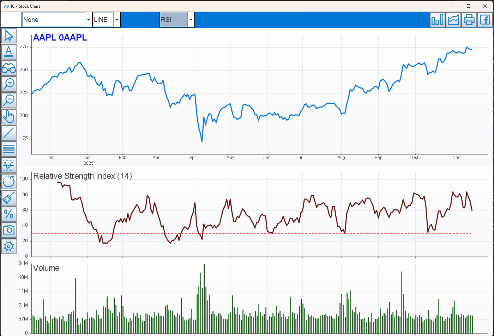

# IC Project

A Java Swing-based stock charting application with multi-provider data sourcing, technical analysis indicators, and interactive drawing tools.

## Current Status
- Active providers: Yahoo Finance (default, no API key), Alpha Vantage (rate-limited)
- Technical Indicators: RSI, MACD, Bollinger Bands, STC, William %R, OBV, Moving Averages
- Drawing Tools: Trend lines, Parallel lines, Golden Ratio partition
- Recent refactors: Centralized labels (`ChartLabelText`), documentation moved to `docs/`

## Screenshot



## Directory Structure (key folders)
```
ic/
├── build.gradle
├── config.properties
├── README.md
├── docs/
│   ├── DATA_PROVIDERS.md
│   ├── REFACTORING_SUMMARY.md
│   ├── TA_LABEL_FIX_SUMMARY.md
│   ├── TA_LABEL_OVERLAP_FIX.md
│   ├── UI_IMPROVEMENTS_SUMMARY.md
│   ├── QUICK_START.md
│   ├── FIX_BUILD_ERRORS.md
│   └── BUILD_FIX_SOLUTION.md
├── src/
│   ├── main/java/com/ic/app/GUI.java
│   ├── main/java/com/ic/core/ChartScreen.java
│   ├── main/java/com/ic/core/ChartLabelText.java
│   ├── main/java/com/ic/data/provider/* (data sources)
│   ├── main/resources/ (images, stocks.csv)
│   └── test/java/com/ic/test/DataProviderTest.java
└── build/ (generated artifacts)
```

## Prerequisites
- Java 21+ (set `JAVA_HOME` accordingly)
- Gradle 8.13+ (wrapper included)

## Quick Start (Yahoo Finance Default)
```powershell
# Windows PowerShell
./gradlew.bat clean build
./gradlew.bat run
```
Or (Unix-like):
```bash
./gradlew clean build
./gradlew run
```

## Switching Data Providers
Edit `config.properties`:
```properties
# Options: YAHOO_FINANCE, ALPHA_VANTAGE
data.source.provider=YAHOO_FINANCE
api.key.alphavantage=YOUR_API_KEY_HERE
```
Yahoo Finance requires no key; Alpha Vantage free tier is limited (25 requests/day).

## Running from JAR
```powershell
java -jar build/libs/ic-1.0-SNAPSHOT.jar
```

## Features
- Multi-provider data (factory pattern)
- Candlestick, Line, Bar, Volume charts
- Percentage comparison mode
- Technical indicators: MA (SMA/WMA/EMA), Bollinger Band, MACD, RSI, STC, OBV, William %R
- Interactive zoom and pan
- Mouse-based drawing & measurement tools
- Golden ratio partition overlay
- Symbol input (type any ticker, e.g., AAPL, MSFT)

## Architecture Overview
```
RequestCommand -> DataSourceFactory -> (YahooFinanceProvider | AlphaVantageProvider ...)
ChartDataService -> ChartScreen (render) -> User Interaction (ActionCommand)
```

## Documentation (see `docs/`)
- DATA_PROVIDERS.md – Provider capabilities and limits
- QUICK_START.md – Alternate startup flows
- REFACTORING_SUMMARY.md – Recent code base improvements
- TA_LABEL_FIX_SUMMARY.md / TA_LABEL_OVERLAP_FIX.md – Indicator label fixes
- UI_IMPROVEMENTS_SUMMARY.md – Visual polish changes
- FIX_BUILD_ERRORS.md / BUILD_FIX_SOLUTION.md – Build stabilization notes

## Troubleshooting
### Build Issues
```powershell
./gradlew.bat clean build --refresh-dependencies
```

### "NoClassDefFoundError: org/json/JSONObject"
This was fixed by bundling all dependencies into the JAR (fat JAR). If you still see this:
```powershell
# Rebuild with dependencies
./gradlew.bat clean build
```
See `docs/JSON_DEPENDENCY_FIX.md` for details.

### "No data available"
- Verify symbol (e.g., AAPL, IBM)
- If Alpha Vantage: check rate limit or key correctness
- Switch to `YAHOO_FINANCE` in `config.properties`

### Empty / Incorrect Indicator Labels
- Confirm `ChartLabelText` indices for TA labels (see docs for mapping)

## Contributing
1. Fork / branch
2. Keep UI changes isolated (core logic vs rendering)
3. Add/update docs under `docs/`
4. Ensure build passes before PR: `gradlew.bat clean test build`

## License
Add your license text here.
